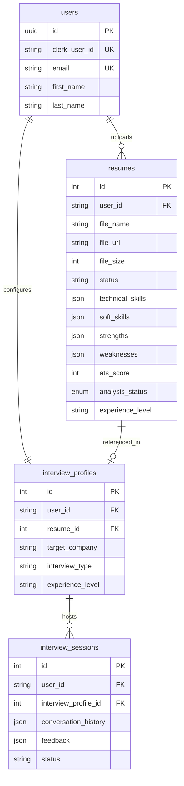
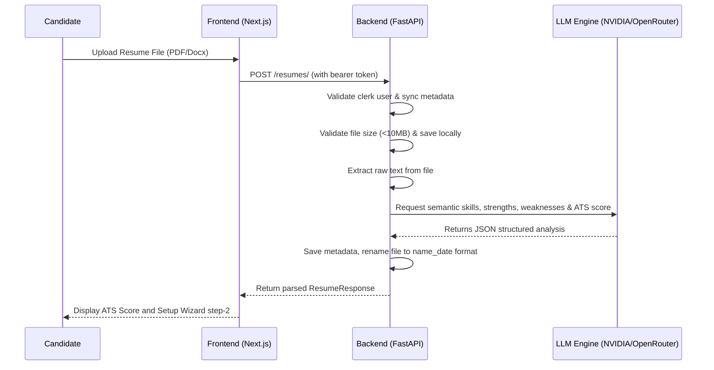
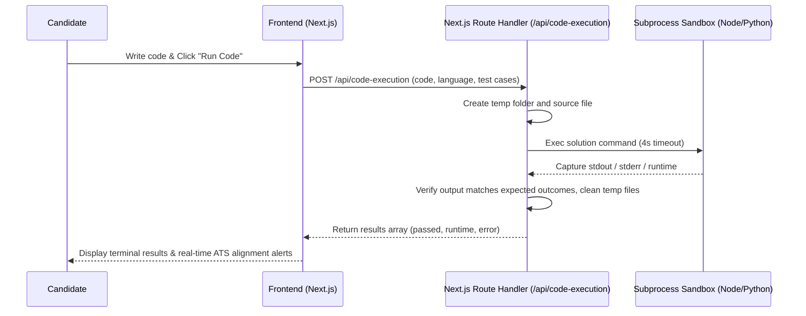

# Product Requirement Document (PRD) — ElevateIQ

## 1. Executive Summary & Overview
ElevateIQ is an AI-driven, personalized technical interview preparation and resume analysis platform. The software aims to prepare engineering candidates for rigorous technical interviews at top-tier companies by analyzing their resumes, recommending target organizations based on their skills, simulating live behavioral/system design interviews with adaptive verbal feedback loops, and hosting a local compiler sandbox for coding challenges with real-time feedback.

---

## 2. Target Audience & Value Proposition
*   **Target Users:** Software Engineers, Tech Leads, and Engineering Managers looking to practice algorithmic coding and technical/behavioral communication loops.
*   **Key Value Proposition:**
    *   **Automated ATS & Rubric Evaluation:** Instant feedback on resume ATS alignment and response quality based on strict rubric scoring.
    *   **Calibrated & Adaptive Grading:** Dynamic interview difficulty adjustments based on historical user answers, preventing repetitive loops and mimicking real-life rigor.
    *   **Local Code Execution Sandbox:** A lightweight, secure environment to write, compile, and execute algorithmic code in multiple languages with real-time compliance feedback.

---

## 3. Core Features & System Modules

```
┌────────────────────────────────────────────────────────────────────────┐
│                              ElevateIQ                                 │
└───────────────────────────────────┬────────────────────────────────────┘
                                    │
         ┌──────────────────────────┼──────────────────────────┐
         ▼                          ▼                          ▼
┌──────────────────┐      ┌──────────────────┐      ┌──────────────────┐
│  Resume Module   │      │ Interview Module │      │  Coding Sandbox  │
├──────────────────┤      ├──────────────────┤      ├──────────────────┤
│ • Upload PDF/Doc │      │ • Setup Wizard   │      │ • JS/Python Exec │
│ • Text Extraction│      │ • LLM Q&A Loop   │      │ • Test Execution │
│ • Skill Parsing  │      │ • Speech-to-Text │      │ • Code Quality   │
│ • ATS Alignment  │      │ • Hints API      │      │   Rubric Analysis│
└──────────────────┘      └──────────────────┘      └──────────────────┘
```

### 3.1. Resume Upload & Analysis Module
*   **File Input Support:** Accepting `.pdf` and `.docx` formats up to **10MB**.
*   **Semantic Parsing:** Automatically extracts technical skills, soft skills, strengths, weaknesses, experience level, and date ranges (calculating years of experience).
*   **Semantic Naming:** Renames stored uploads dynamically based on candidate names and date (e.g., `Firstname_Lastname_YYYY-MM-DD.pdf`).
*   **ATS Scoring:** Algorithmic calculation of resume match scoring (0–100) based on targeted domains and tech skills keywords.

### 3.2. Interview Setup Wizard & Company Recommendations
*   **4-Step Wizard Modal:** Steps through uploading a resume, select/search company, select interview type, and choose experience levels.
*   **Synonym & Fuzzy Matching:** Local database and LLM-powered company search allowing candidates to look up tech companies and handle typos or colloquial names (e.g., "social giant" matches Meta).
*   **Skills-Based Recommendation:** Recommends the top 3 best matching target companies aligning with the candidate's parsed skills.

### 3.3. Conversational Interview Practice Loop (Behavioral / System Design)
*   **Voice/Speech Integration:** Speech synthesis (browser text-to-speech) and SpeechRecognition API with automatic submit-on-silence (1.2-second quiet threshold).
*   **Audio Metering:** Visual audio feedback node showing mic live volume levels.
*   **Rubric-Based Evaluation:** Real-time scoring using a strict 0–10 scale:
    *   *0–1:* Blank/offensive response.
    *   *1–2:* 1–2 word answers (strict limit).
    *   *5–6:* Decent answer with details but missing metrics.
    *   *7–8:* Clear STAR structure (Situation, Task, Action, Result) with metrics.
    *   *9–10:* System thinking, business acumen, trade-offs, and metrics.
*   **Calibrated & Adaptive Strictness:** Normal scoring in rounds 1–3, with strictness increased by 20–30% in rounds 4–5 to model realistic expectations.
*   **Streaks & Prompts:** Positive reinforcements for strong streaks and detailed guidance tips for consecutive weak answers.
*   **Contextual Hint Generator:** LLM-generated, non-revealing hints (max 3 per session) based on the current question and draft response.

### 3.4. Algorithmic Coding Challenge Module
*   **Interactive Workspace:** Code editor supporting custom themes, Tab insertions, syntax highlights, and templates.
*   **Real-time ATS Alignment:** Compares coding syntax on-the-fly to ensure candidate matches technical skills stated in their resume (e.g., using async/await patterns).
*   **Subprocess Execution Sandbox:** Temporary filesystem creation to run JavaScript/Python code safely inside shell sub-processes with a **4-second timeout limit** to handle infinite loops.
*   **Automatic Quality Auditing:** Static inspection of algorithm syntax determining time complexity constraints (flagging O(N^2) brute-force loops vs. O(N) lookup maps).

---

## 4. Technical Stack

### 4.1. Frontend Architecture
*   **Framework:** Next.js (App Router), React 18, TypeScript.
*   **State Management:** Zustand with local storage persistence (`elevateiq-interview-store`).
*   **Authentication:** Clerk (clerk/nextjs) utilizing bearer tokens.
*   **Data Fetching:** Custom `ApiClient` wrapping native `fetch` with AbortController timeout boundaries.
*   **Styles & Icons:** Custom CSS rules (`globals.css`) and Lucide Icons.

### 4.2. Backend Architecture
*   **Framework:** FastAPI (Python), Uvicorn Server.
*   **Database ORM:** SQLAlchemy (v2.0) with PostgreSQL.
*   **Migrations:** Alembic for database version control.
*   **Authentication & Security:** Python bearer token validation syncing JWT claims using Clerk JWKS endpoints with cache TTL controls.
*   **External AI Services:** OpenAI API client matching NVIDIA NIM API endpoints or OpenRouter integrations.

---

## 5. Database Schema & Models
All tables extend a standard parent `BaseModel` that automatically appends `created_at` and `updated_at` timezone-aware timestamps.

### 5.1. Entity Relationships (ERD)



### 5.2. Data Tables Specification

#### 1. `users` Table
Stores unique user entities synced from Clerk.
*   `id`: `UUID` (Primary Key).
*   `clerk_user_id`: `String(255)` (Unique, Indexed, Nullable=False).
*   `email`: `String(255)` (Unique, Nullable=False).
*   `first_name`: `String(100)` (Nullable=False).
*   `last_name`: `String(100)` (Nullable=False).

#### 2. `resumes` Table
Maintains upload details and parsed resume analytics.
*   `id`: `Integer` (Primary Key, Indexed).
*   `user_id`: `String` (Foreign Key referencing `users.clerk_user_id`, Indexed).
*   `file_name`: `String` (Nullable=False).
*   `file_url`: `String` (Nullable=False).
*   `file_size`: `Integer` (Nullable=False).
*   `status`: `String` (Default: `"uploaded"`).
*   `technical_skills`: `JSON` (List of strings, Nullable=True).
*   `soft_skills`: `JSON` (List of strings, Nullable=True).
*   `strengths`: `JSON` (List of strings, Nullable=True).
*   `weaknesses`: `JSON` (List of strings, Nullable=True).
*   `ats_score`: `Integer` (Nullable=True).
*   `analysis_status`: `Enum('pending', 'completed', 'failed')` (Default: `"pending"`).
*   `experience_level`: `String` (Nullable=True).

#### 3. `interview_profiles` Table
Stores configured targets mapped to start a practice loop.
*   `id`: `Integer` (Primary Key, Indexed).
*   `user_id`: `String(255)` (Foreign Key referencing `users.clerk_user_id`, Unique, Indexed).
*   `resume_id`: `Integer` (Foreign Key referencing `resumes.id` ON DELETE CASCADE).
*   `target_company`: `String` (Nullable=False).
*   `interview_type`: `String` (Nullable=False).
*   `experience_level`: `String` (Nullable=False).

#### 4. `interview_sessions` Table
Maintains session logs, scores, and evaluation matrices.
*   `id`: `Integer` (Primary Key, Indexed).
*   `user_id`: `String(255)` (Foreign Key referencing `users.clerk_user_id`, Indexed).
*   `interview_profile_id`: `Integer` (Foreign Key referencing `interview_profiles.id` ON DELETE CASCADE).
*   `conversation_history`: `JSON` (List of Q&A objects, Default: `[]`).
*   `feedback`: `JSON` (Aggregated round score matrix, strengths, gaps, rewrites, and metrics, Nullable=True).
*   `status`: `String(50)` (Default: `"in_progress"`).

---

## 6. Connecting API Endpoints & Interfaces

### 6.1. FastAPI Backend Routes
All routes except basic health checks require a Clerk Bearer Token passed via HTTP authorization header.

#### 1. Resumes Router (`/resumes`)
*   `POST /resumes/`
    *   **Payload:** Multipart form data containing `file` (UploadFile).
    *   **Response:** `ResumeResponse` containing parsed skills, strengths, experience levels, and ATS scores.
    *   **Behavior:** Saves file to disk, parses text using `extract_text_from_file`, invokes LLM analysis via `analyze_resume`, creates table entries, and updates the file name semantically.
*   `GET /resumes/`
    *   **Response:** `ResumeListResponse` listing all uploaded resumes for the active user.
*   `GET /resumes/{resume_id}`
    *   **Response:** `ResumeResponse` detailing target resume metadata and scores.
*   `GET /resumes/{resume_id}/download`
    *   **Response:** `FileResponse` returning inline file preview (PDF/Docx) with custom attachment headers.
*   `DELETE /resumes/{resume_id}`
    *   **Response:** `ResumeDeleteResponse` confirming database entry and file deletion.

#### 2. Interview Router (`/interviews` & `/api/interview`)
*   `GET /interviews/setup` (or `/api/interview/setup`)
    *   **Response:** `InterviewProfileResponse` showing user's current targeted company preferences.
*   `POST /interviews/setup` (or `/api/interview/setup`)
    *   **Payload:** `InterviewProfileCreate` containing target company, type, level, and resume ID.
    *   **Response:** `InterviewProfileResponse` of upserted profile.
*   `POST /interviews/start` (or `/api/interview/start`)
    *   **Payload:** `InterviewStartRequest` (interview_profile_id).
    *   **Response:** `InterviewStartResponse` containing first question and target configs.
*   `POST /interviews/answer` (or `/api/interview/answer`)
    *   **Payload:** `InterviewAnswerRequest` (session_id, user_transcript).
    *   **Response:** `InterviewAnswerResponse` containing strict rubric feedback (strengths, gaps, score, potential_score, example_rewrites) and the `next_question`.
    *   **Behavior:** Commits round transcript to DB, analyzes score, enforces strictness metrics, checks streaks, increments round index, and terminates the session after 5 rounds.
*   `GET /interviews/companies/search` (or `/api/interview/companies/search`)
    *   **Query Param:** `q` (search term).
    *   **Response:** List of up to 15 matching company dicts (name, industry, logo). Uses difflib substring local search and queries LLM if results are empty.
*   `GET /interviews/companies/recommend` (or `/api/interview/companies/recommend`)
    *   **Query Param:** `resume_id` (Integer).
    *   **Response:** List of 3 recommended company dicts aligning with the resume's skills.
*   `POST /interviews/hint` (or `/api/interview/hint`)
    *   **Payload:** `HintRequest` (session_id, question, user_transcript).
    *   **Response:** `{"hint": "string"}` returning structured 1-2 sentence non-revealing hint guidance.

#### 3. Coding Challenges Router (`/coding`)
*   `POST /coding/submit`
    *   **Payload:** `CodingSubmissionRequest` containing code string, test outcomes, execution time, and memory size.
    *   **Response:** Submission stats confirmation saved inside `InterviewSession.feedback["coding_submissions"]`.

---

### 6.2. Next.js Frontend Route Handlers (`/app/api`)

#### 1. Code Execution (`POST /api/code-execution`)
*   **Payload:** `code`, `language`, `testCases`, `challengeId`.
*   **Response:** Array of execution results (`passed`, `actual`, `expected`, `runtime`, `error`).
*   **Security & Sandbox Behavior:**
    1. Generates a temporary folder `elevateiq-exec-XXXXXX` inside the OS temp directory.
    2. Writes code injected with input parser runners to a local script path (`solution.js` or `solution.py`).
    3. Spawns child processes using `exec("node solution.js")` or `exec("python solution.py")` with a **4-second execution boundary limit**.
    4. Compares stdout returns against test case assertions.
    5. Cleans up temporary directory contents recursively.
    6. Returns a fallback simulation for compiled runtimes (Java, C++, Go, Rust).

#### 2. Feedback Generation (`POST /api/feedback-generation`)
*   **Payload:** `code`, `language`.
*   **Response:** JSON details containing `score` (1–10), list of `strengths`, and list of `gaps`.
*   **Behavior:** Performs static code analysis checking for lookup optimizations (Map, Set, dictionary, hash) vs. brute-force nested loops. Adjusts scoring indices and suggests modern variable scoping rules.

#### 3. Interview Submission Proxy (`POST /api/interview-submit`)
*   **Payload:** Code submission payload.
*   **Response:** Success message saving coding stats into active store states.

---

## 7. Crucial Workflows & System Processes

### 7.1. Resume Analysis Sequence


### 7.2. Conversational Q&A & Adaptive Grading Loop

```mermaid
sequenceDiagram
    participant C as Candidate
    participant FE as Frontend (Next.js)
    participant BE as Backend (FastAPI)
    participant LLM as LLM Engine (NVIDIA/OpenRouter)
    
    FE->>BE: POST /interviews/start
    BE->>LLM: Generate first question targeted to target_company
    LLM-->>BE: First question
    BE->>BE: Save session status as "in_progress"
    BE-->>FE: Return session_id & first question
    FE->>C: Read aloud (Web Speech API) & display question
    
    rect rgb(25, 25, 40)
        Note over C, LLM: Repeated for 5 Q&A Rounds
        C->>FE: Speak response (recorded & transcribed by SpeechRecognition)
        FE->>BE: POST /interviews/answer (with transcript)
        BE->>LLM: Evaluate latest answer against strict 0-10 rubric (STAR criteria)
        LLM-->>BE: Return score, strengths, gaps, rewrites & next question
        BE->>BE: Store round score, adjust strictness (rounds 4+), check streaks
        BE-->>FE: Return feedback metrics & next question
        FE->>C: Read next question aloud
    end
    
    FE->>C: Session completes, route to /feedback to view total aggregate indexes
```


### 7.3. Live Code Execution Sandbox


---

## 8. Non-Functional & Security Requirements
1.  **Code Execution Sandbox Protection:**
    *   Subprocess execution limits are capped to 4 seconds to prevent system resources depletion.
    *   Subprocesses run as low-privilege system tasks to isolate local environments.
    *   File cleanups are handled inside `finally` blocks to prevent leak accumulation in temporal paths.
2.  **Low-Latency Autocompletes:**
    *   Fuzzy searches read local static resources, caching company queries.
    *   LLM search fallbacks cache recommendations on the server to optimize loading states.
3.  **Authentication Security:**
    *   Frontend bearer tokens must align with verified Clerk JWKS keys.
    *   Database sessions are closed safely using FastAPI lifespans.
